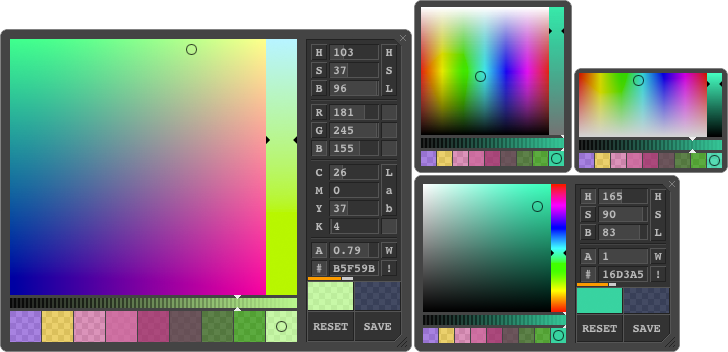

# colorPicker and colors

An advanced, fast and small (45.4KB, 19.5KB gZip) **JavaScript** (framework independent) **color picker** (color chooser) that uses only one javaScript (x.min.js) file, so no extra HTML, CSS, images, etc... on IE9+ and internet browsers.

ColorPicker works in all browsers incl. IE6+ (an extra CSS has to be made to make it work in IE6 though and some additional setTimeout tricks to make it work in IE5.5)<br />
**colorPicker.js** uses **colors.js**, a small but comprehensive tool for color conversions / calculations (WCAG 2.0, contrast, color difference, layer mix, etc.)... 

With **colors.js** (~8.7k or way smaller if other color spaces and complex calculations are taken out...) you can also build your own simpler and / or smaller color pickers quite easy as demonstrated on the [demo page](http://dematte.at/colorPicker).<br />
**colors.js** can convert 182 different combinations of color spaces (rgb2HSV, RGB2hsl, rgb2RGB, HEX2Lab, ...)

If you like it, don't be shy to click the ★ Star button ;o)

Now with new implementations for [JavaScript](javascript_implementation) and [jQuery](jQuery_implementation)

## Demo & integration

See **demo** at [dematte.at/colorPicker](http://dematte.at/colorPicker) or check out a simple jQuery integration at [dematte.at/colorPicker/jQuery_implementation](http://www.dematte.at/colorPicker/jQuery_implementation/) and [jQuery_implementation/jqColor.js](jQuery_implementation) or the javaScript implementation at [dematte.at/colorPicker/javaScript_implementation](http://www.dematte.at/colorPicker/javaScript_implementation/) and [javascript_implementation/jsColor.js](javascript_implementation)



If you put the scripts in the header of your document and try to initialize right away, please make shure that you wrap it in some kind of document.ready wrapper or just put the scripts on the bottom of your document.

All the WCAG 2.0 calculations for readability are also based on opacity levels of all layers<br>
Supported color spaces are: (* also displayed as colors in realtime)<br>
rgb *, hsv(b) *, hsl *, cmyk, cmy, Lab, XYZ, HEX

## Description of files

 - **colors.js** - the color calculation library
 - **colorPicker.data.js** - HTMLS / CSS and images used by the UI
 - **colorPicker.js** - the UI (but not the implementation)

Those three files are used to build the color picker UI and calculate colors as you use it from the UI or from outside, just like shown on the [demo page](http://dematte.at/colorPicker).
**colors.js** doesn't have any dependencies and can be used standalone to build your own color picker or some other app...
Those 3 files are combined and minified in a file named: **color.all.min.js**

If you want to use colorPicker as a plugin that opens on clicks on input fields, remembers colors and it's current size etc. then you need to additionally use the implementations, either
 - **javascript_implementation/jsColor.js** or
 - **jQuery_implementation/jqColor.js**

This is all seperated so you can write your own implementations if you have any special requirements not covered by those quite experimental implementations...

Those folders also include a 'whole package' file so you can go for only one file and don't need to include the others:
 - jsColorPicker.min.js
 - jQueryColorPicker.min.js

Those include **colors.js**, **colorPicker.data.js**, **colorPicker.js** and either **jsColor.js** or **jqColor.js** depending of which implementation you chose.

## colors.js

```javascript
var myColors = new Colors({ // all options have a default value...
    color: 'rgba(204, 82, 37, 0.8)', // initial color (#RGB, RGB, #RRGGBB, RRGGBB, rgb(r, g, b), ...)
    XYZMatrix: ..., // Observer = 2° (CIE 1931), Illuminant = D65  --- see source for dedtails
    XYZReference: ..., // back reference to XYZMatrix --- see source for dedtails
    grey: {r: 0.298954, g: 0.586434, b: 0.114612}, // CIE-XYZ 1931
    luminance: {r: 0.2126, g: 0.7152, b: 0.0722}, // W3C 2.0
    valueRanges: {rgb: {r: [0, 255], g: [0, 255], b: [0, 255]}, hsv:...}, // skip ranges if no conversion required
    customBG: '#808080' // the solid bgColor behind the chosen bgColor (saved color)
    convertCallback: function(colors, type){}, // callback function after color convertion for further calculations...
    toString: function('rgb' || 'hsl' || 'hex' || '' -> 'rgb', forceAlpha) {},
    allMixDetails: false // if set to true, Colors deliveres some more mixed layer informations for all color layers
});
```
## colorPicker.js

colorPicker uses an instance of Colors and passes the options to it, so some values are the same:

```javascript
var myColorPicker = new ColorPicker({
    color: ..., // see Colors...
    mode: 'rgb-b', // initial mode the color picker is starting with
    fps: 60, // the framerate colorPicker refreshes the display if no 'requestAnimationFrame'
    delayOffset: 8, // pixels offset when shifting mouse up/down inside input fields before it starts acting as slider
    CSSPrefix: 'cp-', // the standard prefix for (almost) all class declarations (HTML, CSS)
    size: 0, // one of the 4 sizes: 0 = XXS, 1 = XS, 2 = S, 3 = L (large); resize to see what happens...
    allMixDetails: true, // see Colors...
    alphaBG: 'w' // initial 3rd layer bgColor (w = white, c = custom (customBG), b = black);
    customBG: '#808080' // see Colors...
    noAlpha: true, // disable alpha input (all sliders are gone and current alpha therefore locked)
    cmyOnly: false, // display CMY instead of CMYK
    memoryColors: [{r: 100, g: 200, b: 10, a: 0.8}, ...] // array of colors in memory section
    opacityPositionRelative: undefined, // render opacity slider arrows in px or %
    customCSS: undefined, // if external stylesheet, internal will be ignored...
    appendTo: document.body, // the HTMLElement the colorPicker will be appended to on initialization
    noRangeBackground: false, // performance option: doesn't render backgrounds in input fields if set to false
    textRight: false, // not supported yet. Make numbers appear aligned right
    noHexButton: false, // button next to HEX input could be used for some trigger...
    noResize: false, // enable / disable resizing of colorPicker
    noRGBr: false, // active / passive button right to RGB-R display. Disables rendering of 'real' color possibilities...
    noRGBg: false, // same as above
    noRGBb: false, // same as above
    CSSStrength: 'div.', // not in use
    XYZMatrix: ..., // see Colors...
    XYZReference: ..., // see Colors...
    grey: ..., // see Colors...
    luminance: ..., // see Colors...
    devPicker: false // uses existing HTML instead of internal template for developing
    renderCallback: function(colors, mode){}, // callback on after rendering (for further rendering outside colorPicker)
    actionCallback: function(e, action){}, // callback on any action within colorPicker (buttons, sliders, ...)
    convertCallback: function(colors, type){}, // see Colors...
});
```

## The color model, the methods and more

After initializing Color or ColorPicker you'll get a clean but rich model of the instance:

```javascript
myColors: {
    colors: { all kinds of color values...  see later},
    options: { all the options you set or that are set as default... },
    __proto__: { // all methods Color uses
        setColor: function(newCol, type, alpha) {},
        getColor: function(type) {},
        setCustomBackground: function(col) {},
        saveAsBackground: function() {},
        convertColor: function(color, type) {} // String type: 'rgb2HSL';... converts 182 different combinations
    }
}
```

```javascript
myColorPicker: {
    color: { // instance of Color inside colorPicker
        colors: { all kinds of color values... see later},
        options: { all the options you set or that are set as default... },
        __proto__: { all methods Color uses ... see above}
    },
    nodes: { all kinds of cashed nodes, textNodes and styles, etc... },
    __proto__: { // all methods ColorPicker uses
        setColor: function(newCol, type, alpha, forceRender) {},
        startRender: function(oneTime) {},
        stopRender: function() {},
        setCustomBackground: function(col) {}, // 3rd layer solid bg-color
        saveAsBackground: function() {}, // save current color as bg-color to compare
        setMode: function(mode) {},
        renderMemory: function(memory) {}, // dynamically manipulate memory squares
        destroyAll: function() {}
    }
}
```

The klass ColorPicker has some functions attached, used inside, exported for convenience...

```javascript
ColorPicker.addEvent = function(obj, type, func){}; // with built in cashe
ColorPicker.removeEvent = function(obj, type, func){};
ColorPicker.getOrigin = function(elm){};
ColorPicker.limitValue = function(value, min, max){};
ColorPicker.changeClass = function(elm, cln, newCln){}; // a bit tricky to use...
```

If `allMixDetails` in options is set to true you'll get the following color model

```javascript
HEX: // current color as HEX (upper case, 6 digits)
rgb: // current RGB color as normalized values (0 - 1)
    r: // red
    g: // green
    b: // blue
hsv: // current color values in normalized HSV (HSB) model
    h: // hue
    s: // saturation
    v: // value (brightness)
hsl: // current color values in normalized HSL model
    h: // hue
    s: // saturation
    l: // lightness
cmy: // current color values in normalized CMY model
    c: // cyan
    m: // magenta
    y: // yellow
cmyk: // current color values in normalized CMYK model
    c: // cyan
    m: // magenta
    y: // yellow
    k: // black
Lab: // current color values in normalized CIE 1976 L* a* b* (or CIELAB) model
    L: // lightness
    a: // color-opponent dimension
    b: // color-opponent dimension
XYZ: // current color values in normalized CIE 1931 XYZ model
    X: // mix (a linear combination) of cone response curves (LMS)
    Y: // luminance
    Z: // quasi-equal to blue stimulation (S)
RND: // all above colors in their defined ranges
    rgb: // current RGB color, rounded between 0 and 255
        r: // red (0 - 255)
        g: // green (0 - 255)
        b: // blue (0 - 255)
    hsv: // see above
        h: // hue (0 - 360 degrees)
        s: // saturation (0 - 100 %)
        v: // value (brightness) (0 - 100 %)
    hsl: // see above
        h: // hue (0 - 360 degrees)
        s: // saturation (0 - 100 %)
        l: // lightness (0 - 100 %)
    cmy: // see above
        c: // cyan (0 - 100 %)
        m: // magenta (0 - 100 %)
        y: // yellow (0 - 100 %)
    cmyk: // see above
        c: // cyan (0 - 100 %)
        m: // magenta (0 - 100 %)
        y: // yellow (0 - 100 %)
        k: // black (0 - 100 %)
    Lab: // see above
        L: // lightness (0 - 100 %)
        a: // color-opponent dimension (-128 - 127)
        b: // color-opponent dimension (-128 - 127)
    XYZ: // see above (values might be slightly above 100, dependent on matrix)
        X: // mix (a linear combination) of cone response curves (LMS) (0 - 100)
        Y: // luminance (0 - 100)
        Z: // quasi-equal to blue stimulation (S) (0 - 100)
background: // saved (background) color (saveAsBackground(){})
    rgb: // color in RGB model
        r: // red
        g: // green
        b: // blue
    RGB: // RGB color, rounded between 0 and 255
        r: // red (0 - 255)
        g: // green (0 - 255)
        b: // blue (0 - 255)
    alpha: // alpha or opacity value (0 - 1)
    equivalentGrey: // r = g = b = (0 - 255)
    rgbaMixBlack: // saved (background) color mixed with solid black color
        r: // red
        g: // green
        b: // blue
        a: // resulting alpha or opacity value (0 - 1)
        luminance: // luminance of resulting mix (0 - 1)
    rgbaMixCustom: // saved (background) color mixed with custom (solid) color
        r: // red
        g: // green
        b: // blue
        a: // resulting alpha or opacity value (0 - 1)
        luminance: // luminance of resulting mix (0 - 1)
    rgbaMixWhite: // saved (background) color mixed with solid white color
        r: // red
        g: // green
        b: // blue
        a: // resulting alpha or opacity value (0 - 1)
        luminance: // luminance of resulting mix (0 - 1)
alpha: // alpha or opacity value (0 - 1) of current color
equivalentGrey: // r = g = b = (0 - 1)
HUELuminance: // luminance of hue (in full brightnes and saturation) (0 - 1)
RGBLuminance: // luminance of the current color
hueRGB: // rounded integer value of current color in rgb model with full saturation and brightness
    r: // red (0 - 255)
    g: // green (0 - 255)
    b: // blue (0 - 255)
saveColor: // '' or 'web smart' or 'web save', if so.
webSave: // closest web-save color
    r: // red (0 - 255)
    g: // green (0 - 255)
    b: // blue (0 - 255)
webSmart: // closest web-smart color
    r: // red (0 - 255)
    g: // green (0 - 255)
    b: // blue (0 - 255)
rgbaMixBG: // color mix result: current color above saved (background) color
    r: // red (0 - 1)
    g: // green (0 - 1)
    b: // blue (0 - 1)
    a: // resulting alpha or opacity value (0 - 1)
    luminance: // luminance of resulting mix (0 - 1)
rgbaMixBGMixBlack: // color mix result: current color above saved (background) color above solid black
    r: // red (0 - 1)
    g: // green (0 - 1)
    b: // blue (0 - 1)
    a: // resulting alpha or opacity value (0 - 1)
    luminance: // luminance of resulting mix (0 - 1)
    luminanceDelta: // luminance difference between current color and resulting saved-black mix (0 - 1)
    hueDelta: // hue difference between current color and resulting custom-black mix (0 - 1)
    WCAG2Ratio: // readability vale (1 - 21, 1:1 to 21:1)
rgbaMixBGMixCustom: // color mix result: current color above saved (background) color above solid custom color
    r: // red (0 - 1)
    g: // green (0 - 1)
    b: // blue (0 - 1)
    a: // resulting alpha or opacity value (0 - 1)
    luminance: // luminance of resulting mix (0 - 1)
    luminanceDelta: // luminance difference between current color and resulting saved-custom mix (0 - 1)
    hueDelta: // hue difference between current color and resulting saved-custom mix (0 - 1)
    WCAG2Ratio: // readability vale (1 - 21, 1:1 to 21:1)
rgbaMixBGMixWhite: // color mix result: current color above saved (background) color above solid white
    r: // red (0 - 1)
    g: // green (0 - 1)
    b: // blue (0 - 1)
    a: // resulting alpha or opacity value (0 - 1)
    luminance: // luminance of resulting mix (0 - 1)
    luminanceDelta: // luminance difference between current color and resulting saved-white mix (0 - 1)
    hueDelta: // hue difference between current color and resulting saved-white mix (0 - 1)
    WCAG2Ratio: // readability vale (1 - 21, 1:1 to 21:1)
rgbaMixBlack: // color mix result: current color above solid black
    r: // red (0 - 1)
    g: // green (0 - 1)
    b: // blue (0 - 1)
    a: // resulting alpha or opacity value (0 - 1)
    luminance: // luminance of resulting mix (0 - 1)
    WCAG2Ratio: // readability vale (1 - 21, 1:1 to 21:1)
rgbaMixCustom: // color mix result: current color above solid custom color
    r: // red (0 - 1)
    g: // green (0 - 1)
    b: // blue (0 - 1)
    a: // resulting alpha or opacity value (0 - 1)
    luminance: // luminance of resulting mix (0 - 1)
    WCAG2Ratio: // readability vale (1 - 21, 1:1 to 21:1)
rgbaMixWhite: // color mix result: current color above solid white
    r: // red (0 - 1)
    g: // green (0 - 1)
    b: // blue (0 - 1)
    a: // resulting alpha or opacity value (0 - 1)
    luminance: // luminance of resulting mix (0 - 1)
    WCAG2Ratio: // readability vale (1 - 21, 1:1 to 21:1)
```
